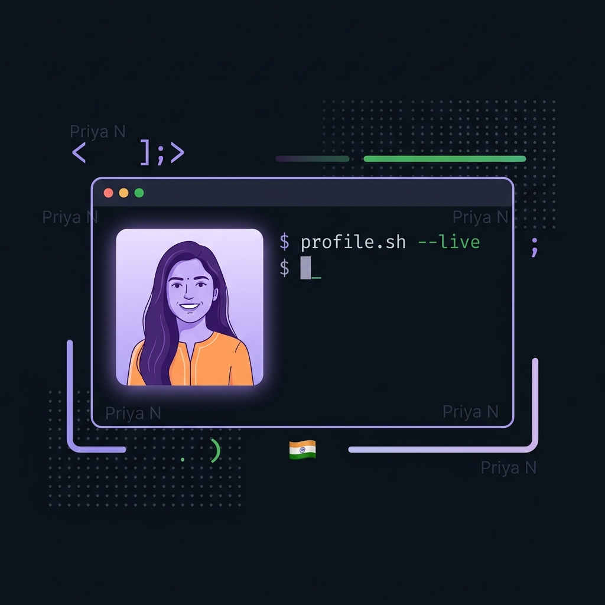
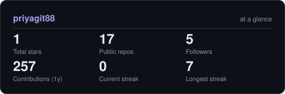

<!-- BANNER - terminal profile.sh --live -->
<picture>
  <source media="(prefers-color-scheme: dark)"  srcset="assets/banner-dark.v9.png">
  <source media="(prefers-color-scheme: light)" srcset="assets/banner-light.v9.png">
  
</picture>

 

<!-- NAME / TAGLINE - animated typing -->

 

<!-- SOCIALS -->
&nbsp;&nbsp;
&nbsp;&nbsp;

 

---

## This is me :)

Hi, I'm **Priya N**, a passionate full-stack developer and MCA student from Bangalore 🇮🇳.  
I love building web applications that are **scalable, secure, and actually useful** for real people.

- 🏢 **Software Developer Trainee at [Gnarus Solutions](https://gnarussolutions.com)**: Built an end-to-end e-commerce application with **Odoo ERP** — integrating Sales, Purchase, Inventory, Website & PoS modules.
- 🎓 Currently pursuing **MCA at Rashtreeya Vidyalaya College of Engineering (RVCE)**, Bangalore (2025–2027).
- 🏆 **2nd Place** at the Hackathon held at **MSRIT, 2026** — turning pressure into product!
- ⭐ **4th Rank** in BCA program across **Bengaluru City University** with a 9.7 CGPA.
- 🧩 Built a full-featured **number-link puzzle game** (Zip Game) with procedural level generation, undo/hint mechanics & a real-time scoring system.
- 🌱 **On a mission:** to craft software that solves real-world problems — one clean commit at a time.
- 💬 Talk to me about **full-stack web dev, ERP systems, or hackathon strategy** and I'm all yours.

 

## my perfect stack`

---

## signals

<table>
<tr>
<td width="50%" align="center" valign="middle">

<!-- Self-rated radar - edit assets/skills.json, the workflow redraws it -->
<picture>
  <source media="(prefers-color-scheme: dark)"  srcset="assets/radar-dark.svg">
  <source media="(prefers-color-scheme: light)" srcset="assets/radar-light.svg">
  
</picture>

</td>
<td width="50%" align="center" valign="middle">

<!-- Hand-authored language & stack radar - edit assets/langmix.json -->
<picture>
  <source media="(prefers-color-scheme: dark)"  srcset="assets/radar-langs-dark.svg">
  <source media="(prefers-color-scheme: light)" srcset="assets/radar-langs-light.svg">
  
</picture>

</td>
</tr>
</table>

---

## Numbers matter? ohhh yes.

<picture>
  <source media="(prefers-color-scheme: dark)"  srcset="assets/card-stats-dark.svg">
  <source media="(prefers-color-scheme: light)" srcset="assets/card-stats-light.svg">
  
</picture>

 

---

## featured projects

| Project | Stack | Highlights |
|---|---|---|
| 🏫 **Campus Resource Management** | React · Node.js · Express · MongoDB | Full-stack booking system for classrooms, labs & seminar halls with real-time admin oversight |
| 🧩 **Zip Game** | Java · JavaScript | Number-link puzzle on a 6×6 grid with procedural level gen, undo/hint & best-time tracking |
| 🛒 **Odoo E-Commerce App** | Odoo ERP · Python · PostgreSQL | End-to-end e-commerce with Sales, Purchase, Inventory, Website & PoS module integration |

---

` Built with love · @priyatechh `

